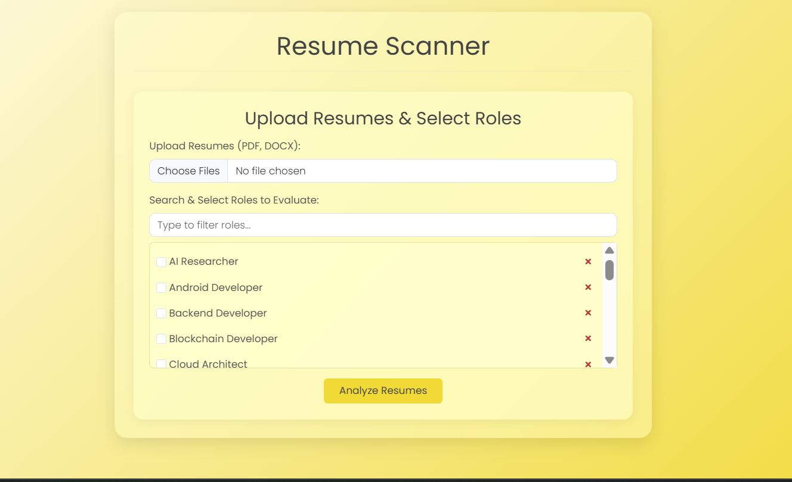
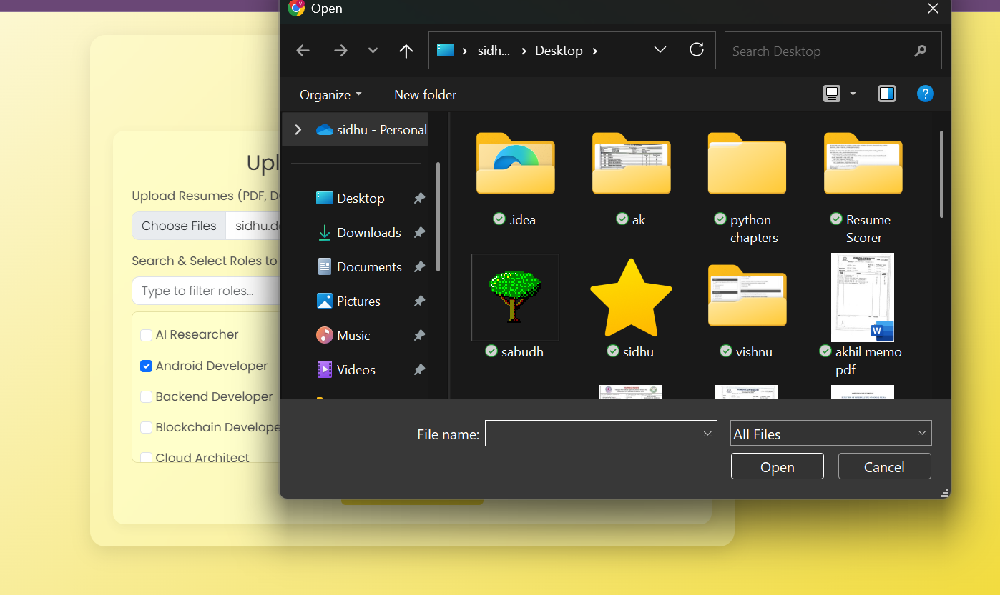
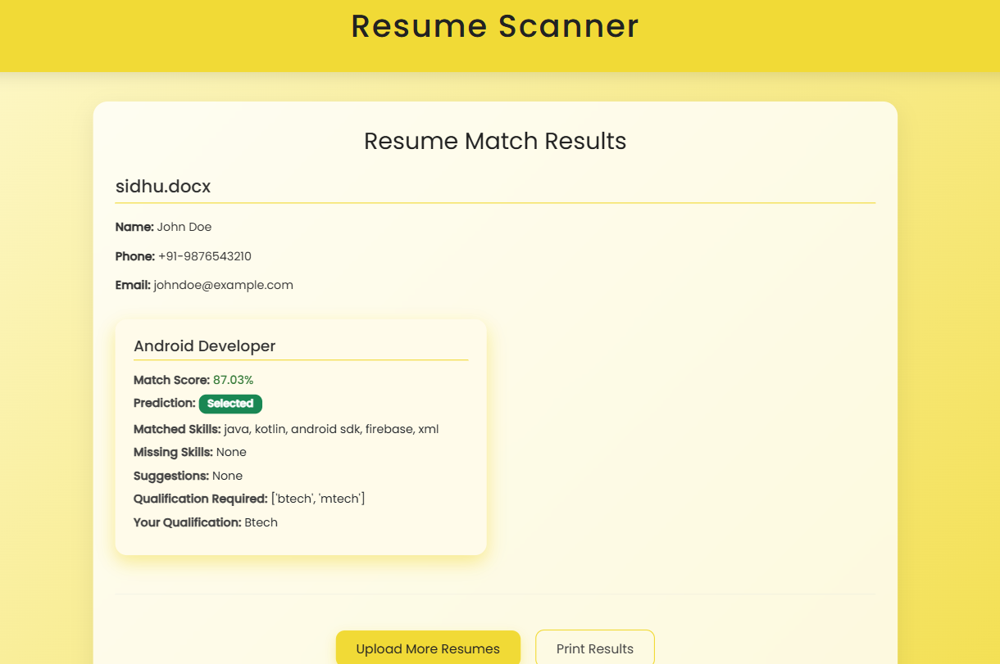
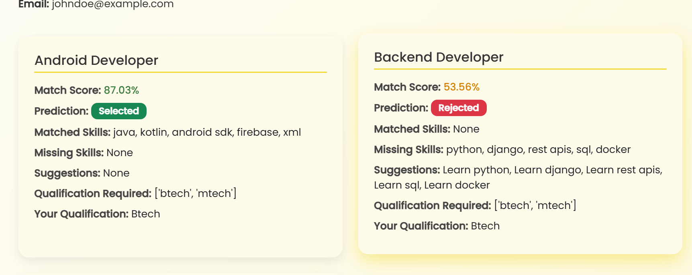

🧠 Resume Scorer – AI-Powered Resume Evaluation

🚀 Overview  
Resume Scorer is an intelligent microservice designed to evaluate student or candidate resumes against specific job roles such as *Amazon SDE*, *ML Internship*, and *GATE ECE*.  
It uses a realistic dataset and applies machine learning techniques to compute match scores, identify missing skills, and provide targeted feedback.

---

---

✅ Key Features

📄 Structured Resume Evaluation  
- Extracts skills only from "Skills" and "Strengths" sections  
- Identifies matched and missing skills based on job role  
- Extracts qualifications, latest project, and internship details  

🧠 Machine Learning Pipeline  
- Text vectorization using TF-IDF  
- Role classification using Logistic Regression  
- Trained on a dataset with 20 unique job roles and 250 samples each  
- Outputs: Match Score, Matched & Missing Skills, Extracted Info  

---

📁 Multi-Resume, Multi-Role Scoring  
- Supports bulk resume uploads  
- Evaluates multiple resumes against multiple selected roles  
- Outputs structured CSV reports with match results  

---

🌐 Flask Web Application  
- Clean, user-friendly interface  
- Allows resume uploads and role selection  
- Displays results with visual breakdowns

📊 Sample Output 

---

🔧 Technologies Used  
- Python  
- Flask 
- Scikit-learn  
- TF-IDF Vectorizer  
- Logistic Regression  
- Pandas, NumPy  
- HTML/CSS (for web UI)  

---

🔒 Security Note  
This project is for educational and demonstration purposes only.  
It is not intended to replace real-world HR or ATS systems and does not handle personal data beyond resume text processing.

---

🙌 Acknowledgments  
This project was designed and developed with guidance and technical support from **ChatGPT by OpenAI**.
